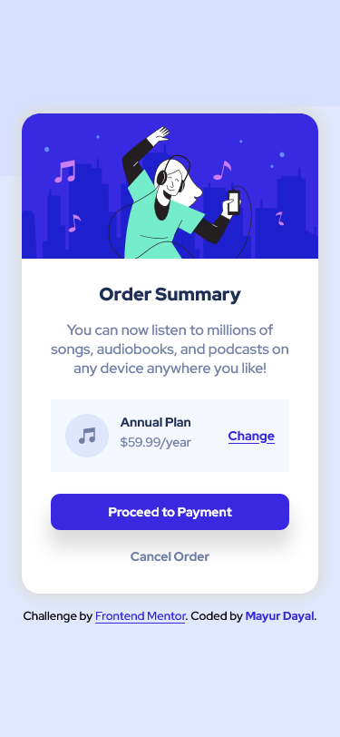
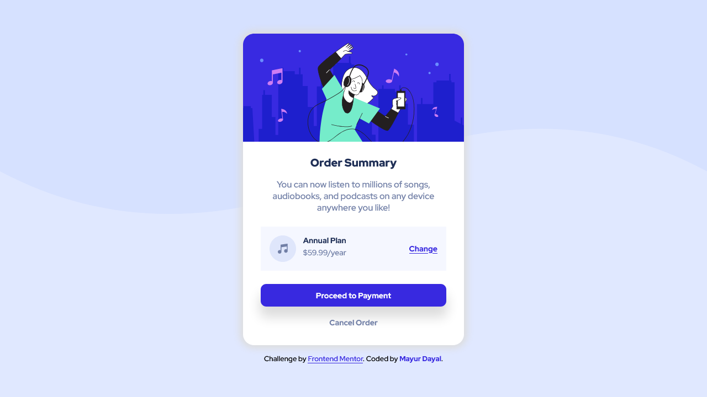
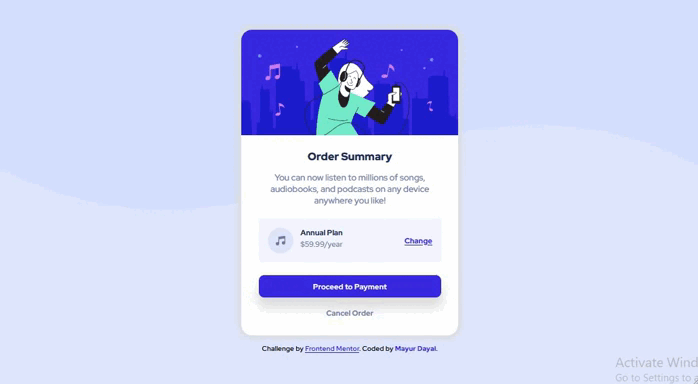

# Frontend Mentor - Order summary card

This is a solution to the [Order summary card challenge on Frontend Mentor](https://www.frontendmentor.io/challenges/order-summary-component-QlPmajDUj). Frontend Mentor challenges help you improve your coding skills by building realistic projects. 

## The challenge

Your challenge is to build out this order summary card component and get it looking as close to the design as possible.

You can use any tools you like to help you complete the challenge. So if you've got something you'd like to practice, feel free to give it a go.

Your users should be able to:

- See hover states for interactive elements

**To do this challenge, you need a basic understanding of HTML and CSS.**

## Screenshot

### Mobile Screenshot 

### Desktop Screenshot 

### Active States Screenshot 

## Links

- Solution URL: [https://github.com/mayurDayal2000/order-summary-component-main](https://github.com/mayurDayal2000/order-summary-component-main)
- Live Site URL: [https://mayurdayal2000.github.io/order-summary-component-main/](https://mayurdayal2000.github.io/order-summary-component-main/)

## Built with

- Semantic HTML5 markup
- CSS custom properties
- Flexbox
- CSS Grid
- CSS Position
- Mobile-first workflow

## Author

- Frontend Mentor - [@mayurDayal2000](https://www.frontendmentor.io/profile/mayurDayal2000)
- Twitter - [@mayur_dayal_5k](https://twitter.com/mayur_dayal_5k)